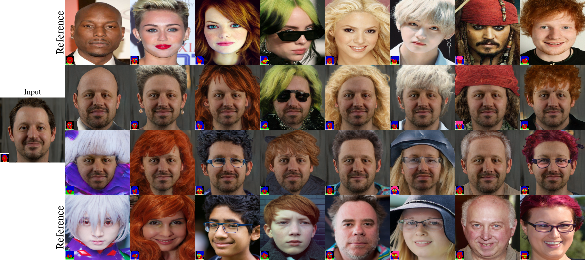
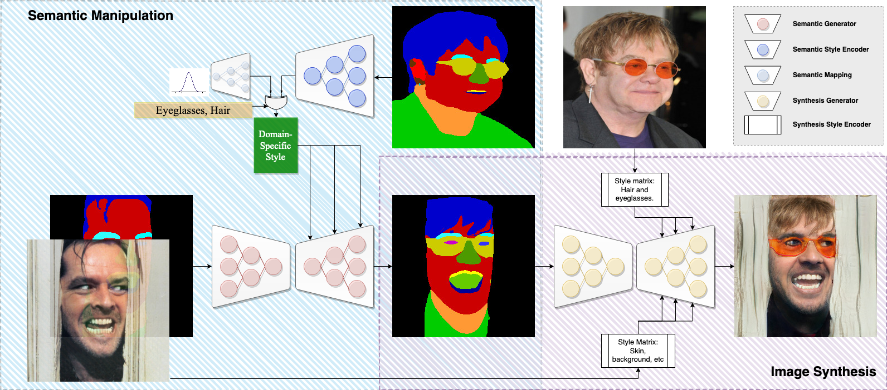

# SMILE: Semantically-guided Multi-attribute Image and Layout Editing
## Official PyTorch Implementation 
### [[Paper :newspaper:](https://openaccess.thecvf.com/content/ICCV2021W/AIM/html/Romero_SMILE_Semantically-Guided_Multi-Attribute_Image_and_Layout_Editing_ICCVW_2021_paper.html)] &emsp; [[Video :video_camera:](https://youtu.be/KOMdKsJB1ys)] &emsp; [[Poster :scroll:](https://affromero.github.io/SMILE/resources/SMILE_POSTER.pdf)] &emsp; [[Slides :pushpin:](https://affromero.github.io/SMILE/resources/SMILE_slides.ppsx)]

<p align="left"></p>

## :sparkles: Results
SMILE can manipulate a source image into ab output image reflecting the attribute and style (e.g., eyeglasses, hat, hair, etc.) of a different person. More high-quality videos can be found in [this](https://twitter.com/affromero) link.

<p align="left"></p>

Checkout the [project page](https://affromero.github.io/SMILE/) for additional visualizations. 

## Overview of the method
<p align="left"></p>

## :wrench: Download Pretrained Weights
```bash
bash download_weights.sh
```

## :zap: Demo 
```bash
python main.py --GPU=NO_CUDA --FAN --EYEGLASSES --GENDER --EARRINGS --HAT --BANGS --HAIR --TRAIN_MASK --MOD --SPLIT_STYLE --mode=demo --ref_demo Figures/ffhq_teaser --rgb_demo Figures/teaser_input.png --pretrained_model models/pretrained_models/smileSEM
```
This command should reproduce the teaser figure. 
Explanation of arguments:
- ```--FAN```: Remove all shortcuts in the upsampling residual blocks and add skip connections with the [adaptive wing based heatmap](https://arxiv.org/abs/1904.07399).
- ```--EYEGLASSES --GENDER --EARRINGS --HAT --BANGS --HAIR```: The selected attributes to manipulate.
- ```--TRAIN_MASK```: Use semantic maps instead of RGB.
- ```--MOD```: Use modulated convolutions.
- ```--SPLIT_STYLE```: Weight Gender with more dimensionality than the others.
- ```--ref_demo```: Folder with reference images. During demo an attribute classifier is going to extract every attribute to impose them on the ```--rgb_demo```. See teaser figure.

## :earth_asia: Citation
If you find this work is useful for your research, please cite our paper:
```latex
@InProceedings{Romero_2021_ICCV,
    author    = {Romero, Andres and Van Gool, Luc and Timofte, Radu},
    title     = {SMILE: Semantically-Guided Multi-Attribute Image and Layout Editing},
    booktitle = {Proceedings of the IEEE/CVF International Conference on Computer Vision (ICCV) Workshops},
    month     = {October},
    year      = {2021},
    pages     = {1924-1933}
}
```